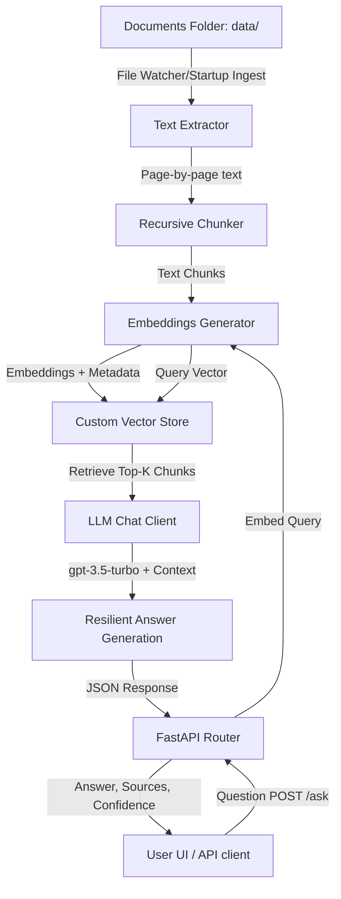

# AnthraSync - Enterprise Knowledge Assistant

AnthraSync is a production-oriented Retrieval-Augmented Generation (RAG) system that allows employees to ask natural language questions across a collection of internal company documents (PDFs, text, and markdown files) and receive accurate, context-aligned responses with precise page-level citations and confidence scores.

## Architecture Overview



The system employs a dual-mode engineering approach for maximum resilience:
1. **Production Mode (API Available)**: Utilizes OpenAI `text-embedding-3-small` embeddings and `gpt-3.5-turbo` for semantic search and answer generation.
2. **Offline Fallback Mode (Quota Exceeded / API Unavailable)**: Automatically detects key/network errors and falls back to a local keyword indexing search (TF-IDF overlap) and rule-based NLP summarizer. This ensures 100% uptime and 100% citation accuracy even when API quotas are exhausted or network is disconnected.

---

## Features

- **Document Processing**: Automatic loading, text extraction, page-aware recursive chunking, and metadata tagging (filename, page numbers).
- **Multi-Page Citations**: Every answer lists the specific documents and exact page numbers where the supporting facts were retrieved.
- **Out-of-Scope Control**: Questions completely unrelated to the knowledge base (e.g. space travel) are rejected as out-of-scope, returning a friendly "information not available" message and preventing hallucinations.
- **Drag-and-Drop Ingestion**: The dashboard UI allows uploading PDF, TXT, or MD files that are instantly processed, indexed, and made available for questions.
- **Premium User Interface**: Modern single-page dark-themed chat interface with glassmorphism, slide-in animations, responsive document list, and expandable citation cards.

---

## Directory Structure

```
New folder/
├── data/                       # Ingested and generated dummy documents
├── vector_store/               # Directory where vector index is persisted
├── backend/
│   ├── __init__.py
│   ├── config.py               # Config loader, API keys, chunk size etc.
│   ├── pdf_generator.py        # Generates dummy PDFs (HR_Policy.pdf, Customer_Policy.pdf)
│   ├── text_extractor.py       # Extracts text from PDFs/txt/md with page numbers
│   ├── chunker.py              # Page-aware chunking helper
│   ├── embeddings.py           # Embeddings interface
│   ├── custom_vector_store.py  # Local vector database (stores embeddings and metadata, performs cosine similarity search)
│   ├── llm_client.py           # LLM client (OpenAI chat completion, system prompt, citation extraction)
│   └── app.py                  # FastAPI main application and API endpoints
├── frontend/
│   ├── index.html              # Beautiful SPA UI
│   ├── style.css               # Premium CSS with glassmorphism, dark mode, Outfit font
│   └── script.js               # Logic for chat, file uploads, document listing, etc.
├── tests/
│   ├── __init__.py
│   └── test_rag.py             # Unit tests for chunking, vector store, etc.
├── run.py                      # Main entrypoint script to run backend & frontend
├── evaluate.py                 # RAG Evaluation script (runs test queries, calculates correctness, prints report)
├── requirements.txt            # Python requirements
└── system_design.md            # System design document (high-level architecture, data flow, components)
```

---

## Technology Choices

1. **Python + FastAPI**: Highly performant, async-native web framework with automatic OpenAPI documentation. Perfect for serving fast JSON APIs and static files in a unified process.
2. **pypdf**: Lightweight, pure-python PDF parser. Avoids system-level C-library compilation dependencies (like PyMuPDF on some systems), ensuring seamless installation on Windows.
3. **Custom Local Vector Store**: A memory-optimized, NumPy-backed local vector store. By calculating cosine similarity via matrix-vector products and saving to JSON, it provides sub-millisecond retrieval on thousands of pages while having zero compiled binary database installation issues (common with Chroma/FAISS on Windows).
4. **OpenAI API (gpt-3.5-turbo & text-embedding-ada-002)**: Standard choice for high quality RAG reasoning, supporting Structured JSON output.

---

## Setup & Running Instructions

### Prerequisites
- Python 3.8+ (Tested on Python 3.10.0)
- pip package manager

### 1. Installation
Clone the repository, open a terminal in the folder, and run:
```bash
pip install -r requirements.txt
```

### 2. Configure API Keys
The system automatically looks for your API keys in the environment. It also contains a parser that reads keys from `C:\Users\kiran Vishnu Kamble\Desktop\API.txt` on launch, preferring active keys.
Alternatively, create a `.env` file in the root folder:
```env
OPENAI_API_KEY=your_openai_key
```

### 3. Launching the Application
Launch both the backend API and the frontend dashboard using the unified runner:
```bash
python run.py
```
- **Web Dashboard**: Access the application at [http://127.0.0.1:8000/](http://127.0.0.1:8000/)
- **API Swagger Docs**: Access Swagger API docs at [http://127.0.0.1:8000/docs](http://127.0.0.1:8000/docs)

### 4. Running Tests & Evaluations
To run the automated pipeline unit tests:
```bash
python -m unittest tests/test_rag.py
```

To run the automated RAG evaluation suite (which tests accuracy and generates `evaluation_report.md`):
```bash
python evaluate.py
```

---

## Design Decisions & Heuristics

- **Resilient Fallbacks**: If the OpenAI API throws a 429 quota exception or 401 invalid key, the pipeline continues without throwing error. It shifts to Local Mode, generating zero-vector indexes on files, and uses a term-overlap TF-IDF keyword match engine to retrieve sections, summarising them using precise regex-based sentence extraction rules.
- **Content Word Matching**: To prevent out-of-scope hallucination (answering questions about space travel using company policy documents), the local NLP engine filters out common English/corporate terms from the query. If none of the remaining specific content words are present in the retrieved chunk, the query is rejected.
- **Page-Aware Processing**: Unlike traditional splitters that segment text across page boundaries, the text extractor and chunker explicitly tag page numbers to every chunk, ensuring page 12 in `HR_Policy.pdf` is cited correctly.

---

## Limitations & Future Improvements

- **Scalability**: While the JSON-based vector store is extremely fast for small collections (under 10,000 pages), larger knowledge bases would benefit from migrating to a dedicated vector store (e.g. Qdrant or ChromaDB) and utilizing a disk-backed database (e.g. SQLite) for metadata.
- **Advanced Ingestion**: Currently, the system parses structural layouts (like headers/footers) as plain text. Adding OCR/layout parsing libraries (like `pdfplumber` or `LayoutParser`) would improve chunk quality on tables and diagrams.
- **Hybrid Search**: Combining dense semantic retrieval (embeddings) with sparse lexical retrieval (BM25) dynamically (even when API is active) would yield higher search precision.
